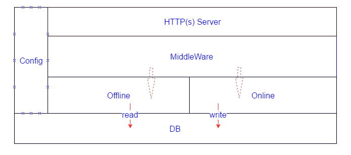

# MockXServer

## Release

## 说明
支持oneline 和 offline 两种工作模式。同时支持http和https方式。
offline时，或者称为MockServer，顾名思义，离线使用的后台服务，即模拟真实的server，当后台服务不可达，或者在开发模式下使用。
特别在两个团队分前后台开发的时候，把后台服务直接模拟出来，两个团队之间只进行API接口编程，这样开发效率也会有较好的提升。

online时，会让其链接真正的service，但是要起到debug的作用。即会提供每次service call的详细信息，并可以将其在api测试工具上进行回放。

## PACT record 生成

## 支持Replay

online时会把请求和对应的相应存储起来作为replayDB，当真实服务不可达时会从replayDB中拉取数据。
同理offline时，首先会从replayDB中寻找请求对应的相应，如果存在对应的响应就返回，否则走offline的handler处理。

## offline

1.	RESTFul资源服务器，作为离线使用需要完成正常的所有功能。
2. 	自带存储，需要存储可能重复使用的信息。保证功能的完备性

## online

1. 类似API的proxy，直接将请求路由给目的服务器。
2. 目前是主要记录请求和响应信息，http相关的能够完整的记录下来。
3. 因为实际使用是走https的，所以这个proxy可以将请求做二次处理，并能记录详细信息。

## config.json说明

1. runMode， 表示offline和online；
2. TLS，是否起用https模式；
3. remoteServer，online时，请求的远程服务器；
4. listenOn, APIService的监听地址。
5. LogFile, 日志文件名字。留空的话直接打印到命令行窗口。

## 结构图：

## 运行流程图

### Third party lib

1. [httprouter](http://godoc.org/github.com/julienschmidt/httprouter)
2. [boltDB](http://godoc.org/github.com/boltdb/bolt)
3. [PACT-go](https://github.com/SEEK-Jobs/pact-go)
